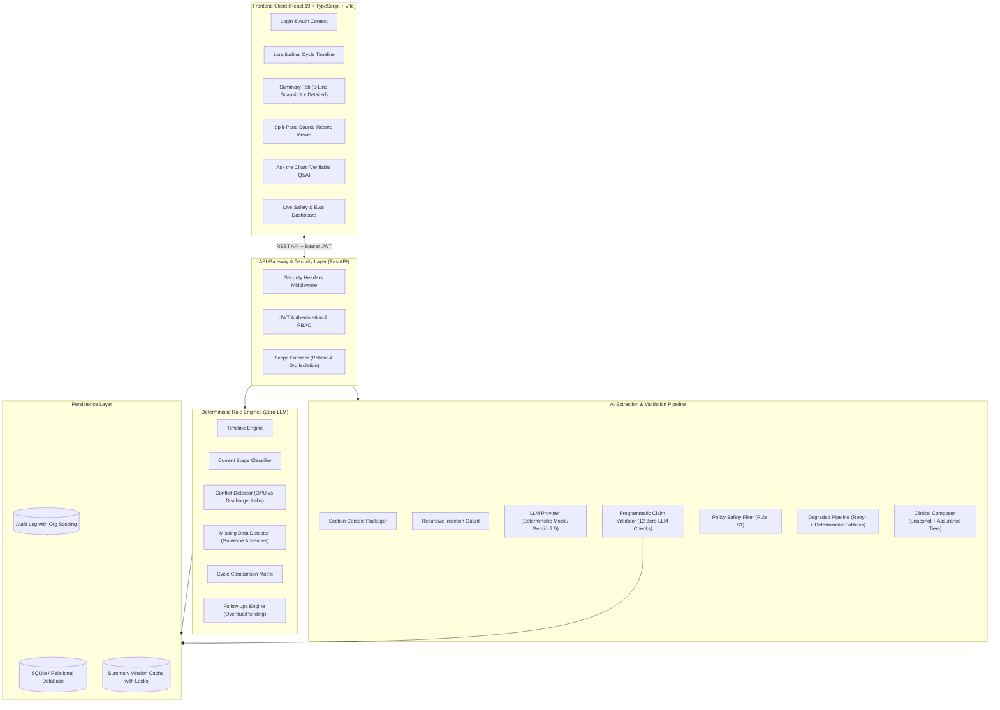

# OVA — Ovarian Verification & Assistance

> **High-Assurance Clinical Safety & Longitudinal Summary Platform for Reproductive Medicine**

OVA is an auditable clinical decision-assistance platform purpose-built for reproductive endocrinologists and IVF specialists. It synthesizes complex, fragmented fertility records across clinical cycles into a unified, verified chart—detecting cross-record contradictions, flagging unperformed workups, and enforcing non-negotiable safety guardrails with zero hallucinated clinical advice.

---

## Quickstart: One-Command Setup

### Option 1: Docker Compose (Recommended — Zero Host Dependencies)

Clone the repository and run:

```bash
docker compose up --build
```

This single command will:
1. Build and configure the FastAPI backend and Node/Nginx frontend containers.
2. Initialize and seed the database with synthetic clinical test cohorts (`P-101` through `P-106`).
3. Launch the **Backend API** at `http://localhost:8000` (Swagger UI at `http://localhost:8000/docs`).
4. Launch the **Frontend Web App** at `http://localhost:5173`.

---

### Option 2: Local Setup (PowerShell / Windows)

```powershell
# 1. Install Python dependencies
pip install -r backend/requirements.txt

# 2. Seed database
.\make.ps1 seed

# 3. Start Backend server (Port 8000)
$env:PYTHONPATH="backend"
python -m uvicorn app.main:create_app --factory --host 127.0.0.1 --port 8000

# 4. In a second terminal: Start Frontend (Port 5173)
cd frontend
npm install
npm run dev
```

---

### Option 3: Local Setup (macOS / Linux Makefile)

```bash
# 1. Install & seed in one command
make seed

# 2. Start services
uvicorn app.main:create_app --factory --app-dir backend --host 127.0.0.1 --port 8000 &
cd frontend && npm install && npm run dev
```

---

## Demo Personas & Credentials

| Role | Username | Password | Organization | Assigned Patients |
|---|---|---|---|---|
| **Doctor** | `dr.rao` | `doctor123` | Kernel Prime Fertility (`ORG-Y`) | P-101, P-102, P-103, P-104, P-105 |
| **Doctor (External)** | `dr.kumar` | `doctor123` | Bloom Reproductive Institute (`ORG-Z`) | P-106 |
| **Admin** | `admin` | `admin123` | Kernel Prime Fertility (`ORG-Y`) | System-wide Audit Logs |
| **Staff** | `staff.priya` | `staff123` | Kernel Prime Fertility (`ORG-Y`) | Operational scheduling |

---

## Architecture Diagram



---

## Clinical Safety Design & Non-Negotiable Rules

OVA was engineered around strict non-negotiable safety rules governing AI in healthcare:

1. **Rule S1 (No Imperative Advice or Prescription):**
   OVA **never** recommends drug dosing, protocol switches, or diagnoses. Imperative verbs (`should`, `recommend`, `increase`, `titrate`, `switch to`, `candidate for`) are filtered by a zero-LLM policy engine. Advisory questions in *Ask the Chart* are refused with a polite, non-actionable message.
2. **Rule S2 (Strict Grounding & Provenance Traceability):**
   Every clinical fact displayed in the UI carries explicit `source_refs`. Clicking any fact or snapshot item opens the split-pane Source Viewer to inspect the exact hospital document and highlighted sentence.
3. **Rule S3 (Zero-LLM Programmatic Validator):**
   Candidate LLM claims are inspected across 12 deterministic checks: patient scope, cycle attribution, calendar date matching, number & unit verification, medication name matching, polarity negation checks, and field resolution. Blocked claims are stripped and never rendered.
4. **Rule S4 (Active Conflict Surfacing):**
   When clinical documents disagree (e.g. 9 oocytes in the operative report vs 8 in the discharge summary), OVA flags both values side-by-side with dual citations for clinician adjudication. It **never** silently averages or resolves discrepancies.
5. **Rule S5 (Explicit Absence Detection):**
   Missing investigations (e.g. semen analysis in an infertility intake) are explicitly detected and rendered as missing action items. The validator strictly blocks positive claims masquerading as absences.
6. **Rule S6 (Recursive Prompt Injection Defense):**
   All clinical documents, author names, clinic origins, and diagnoses are recursively sanitized against instruction overrides and role-play jailbreaks before prompt assembly.
7. **Rule S7 (Scope-Based Multi-Tenant Isolation):**
   Doctors can only access patients explicitly assigned to their practice. Unassigned access returns HTTP 403 Forbidden. Audit logs are strictly isolated by organization ID (`org_id`).
8. **Rule S8 (Thread-Safe Concurrency & Double-Checked Caching):**
   Per-patient mutex locks prevent race conditions and duplicate generation under concurrent chart requests, with automatic recovery from transactional database constraints.

---

## Environment Variables

| Variable | Default Value | Description | Required |
|---|---|---|---|
| `LLM_PROVIDER` | `mock` | Generative provider: `mock` (deterministic zero-cost emulator) or `gemini` (Google GenAI API). | Optional |
| `GEMINI_API_KEY` | `""` | Google GenAI API key. Required only when `LLM_PROVIDER=gemini`. | Optional |
| `DATABASE_URL` | `sqlite:///./dev.db` | SQLAlchemy database connection URI. | Optional |
| `JWT_SECRET_KEY` | `ova-clinical-safety-secret-key-2026` | Cryptographic secret for signing JWT access tokens. | Production Required |
| `JWT_ALGORITHM` | `HS256` | JWT signing algorithm. | Optional |
| `ACCESS_TOKEN_EXPIRE_MINUTES` | `480` | JWT token validity lifespan (8 hours). | Optional |
| `CORS_ORIGINS` | `["http://localhost:5173", ...]` | Allowed CORS origins list. | Optional |

---

## How to Run Tests

### 1. Run Complete Backend Test Suite (111 Tests)

```bash
$env:PYTHONPATH="backend"
python -m pytest backend/tests -v
```
*Executes all unit, integration, validator, policy, engine, and security tests (110 passed, 1 skipped real-cloud test).*

### 2. Run Review Remediation Regression Suite (SEC-01 through SEC-08)

```bash
$env:PYTHONPATH="backend"
python -m pytest backend/tests/test_review_fixes.py -v
```
*Validates the 8 critical and high security and clinical fixes from `docs/REVIEW.md`.*

### 3. Run Frontend End-to-End & Step Verification Suites

```bash
node frontend/test-e2e.mjs
node frontend/test-step18.mjs
```

### 4. Run Live Evaluation Benchmark Harness

```bash
# Standard benchmark run against gold truth (all 6 seed patients)
python -m app.eval.run_eval

# Adversarial stress test (injecting 60% corrupted claims)
python -m app.eval.run_eval --adversarial
```

---

## Documentation Index

* **[5-Minute Demonstration Script](file:///c:/Users/veerappan/Documents/SA%20Engineering/docs/DEMO_SCRIPT.md):** Complete presenter walkthrough for P-101, P-106, and the evaluation dashboard.
* **[Known Limitations](file:///c:/Users/veerappan/Documents/SA%20Engineering/docs/KNOWN_LIMITATIONS.md):** Honest breakdown of prototype boundaries, synthetic data, and mock modes.
* **[Clinical & Security Review](file:///c:/Users/veerappan/Documents/SA%20Engineering/docs/REVIEW.md):** Detailed security audit with remediations and regression references.
* **[Progress Log & Decisions](file:///c:/Users/veerappan/Documents/SA%20Engineering/docs/PROGRESS.md):** Engineering milestone logs and architectural decision records.
